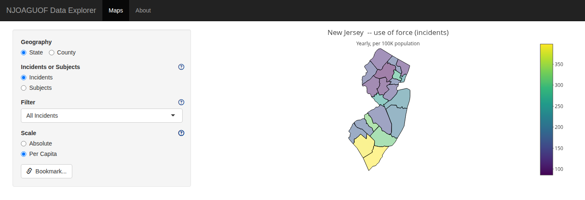

# njoaguofdash

<!-- badges: start -->
[](https://github.com/tor-gu/njoaguofdash/actions)
<!-- badges: end -->

An interactive map of New Jersey use-of-force reports, built to illustrate the
R data package [njoaguof](https://github.com/tor-gu/njoaguof), a repackaging of the [NJ Attorney General's use of force
dataset](https://www.njoag.gov/force/). Currently deployed [here](https://tor-gu-njoaguofdash.share.connect.posit.cloud/).



> If what you want is summary statistics rather than a worked example of the
> data package, the [NJ OAG's own dashboard](https://www.njoag.gov/force/) is
> the better starting point.

## Installation

### Prerequisites
R >= 4.1, plus **GDAL**, **GEOS**, and **PROJ** for `sf`.

For these packages: 
  ```
  sudo apt-get install libgdal-dev libgeos-dev libproj-dev libudunits2-dev
  ```

### Package install
```r
# install.packages("remotes")
remotes::install_github("tor-gu/njoaguofdash")
```
This will pull in `njoaguof` automatically.


## Running it

```r
njoaguofdash::njoaguofdashApp()
```

[pandoc](https://pandoc.org/) must be on the path.

There is also an `app.R` at the repo root for Shiny hosting; see
[Deployment](#deployment).


## Where the data comes from

The use-of-force data comes from `njoaguof`. The About tab will report the version.

Maps and population figures are bundled in `R/sysdata.rda`: TIGER/Line 2024
boundaries from [tigris](https://github.com/walkerke/tigris), and vintage 2024
population estimates from the Census Population Estimates Program.

### Regenerating `R/sysdata.rda`

Only needed when you want newer boundaries or population estimates.

```r
source("data-raw/internal_data.R")
```

## Deployment

`app.R` at the repo root is the entry point for any Shiny host.

### Docker

```
docker build -t njoaguofdash .
docker run --rm -p 3838:3838 njoaguofdash
```

Then open <http://localhost:3838>.

### shinyapps.io / Posit Connect

```r
rsconnect::deployApp()
```

## Development

The project uses [renv](https://rstudio.github.io/renv/). Start R in the
package root to pick up `.Rprofile`.

```r
renv::restore()     # rebuild the library from renv.lock
devtools::document()
devtools::test()
devtools::check()
```

